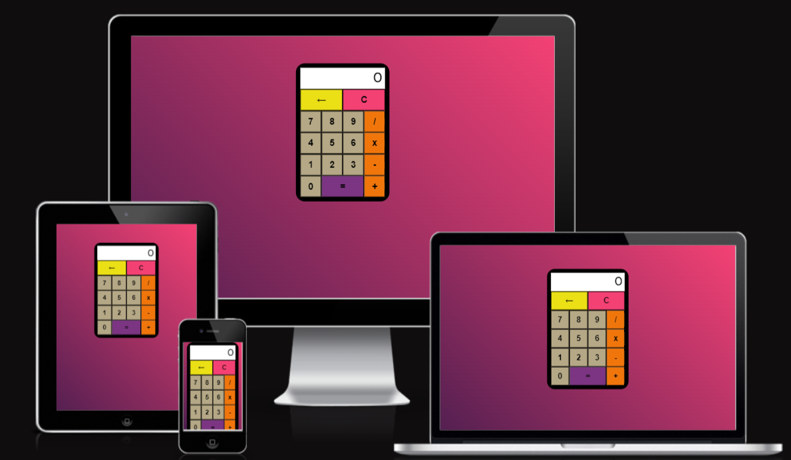
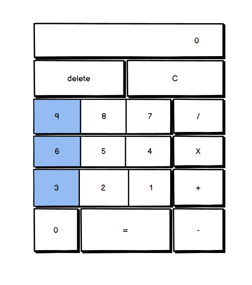
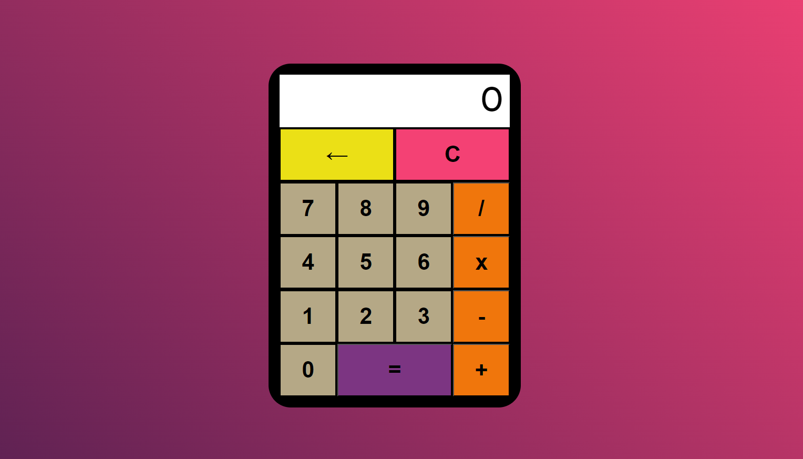
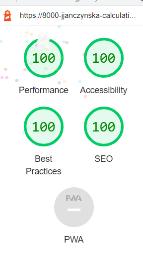

# **Calculating Calculator**

[Visit the deployed project here](https://jjanczynska.github.io/calculating-Calculator/)
---
---
---

### This project is a fully functioning online calculator. 
### The target audience is anyone who needs to make a quick calculation in their daily life- like adding their grocery cost during shopping. 
### It is designed to be responive and easy to accsess on a range of devices - desktop, laptop, tablet or a mobile phone. 
 

---
--- 
## **User Experience**
---
---
### First time visitor goals 
1. As a First Time Visitor - want to be able to know what I am looking at.  Goal checked! **-[x]**
1. As A first Time Visitor - want to use it as any other calculator. Goal checked! **-[x]**


### Design

* Colour scheme 
    * The background colours used are purple and pink
    * Calculator has elements of purple, pink, orange, yellow and grey to contrast use of different buttons.

* Typography
    * Throught the project Prompt font was used with a fallback to Sans-Serif.

* Wireframes 
    * Wireframe was used in the planning stages of the project. The positioning of the buttons is slightly different in the finished project.


    

---
---

## **Features**
---
---
### The calculator consists of a calculator screen. Underneath buttons are located in 5 rows. It is designed so each button is colour coded by its functionality.



### Features left to implement:
* Counter for performed operations
* Modulus for performing operations on **%**
* **.** to perfom operations on fractions
---
---
## **Technologies Used**
---
---
* [HTML5](https://en.wikipedia.org/wiki/HTML5)
* [CSS](https://en.wikipedia.org/wiki/CSS)
* [JavaScript](https://en.wikipedia.org/wiki/JavaScript)

### Libraries and Programs used:
1. Google Fonts: 
    * Google fonts were used to import the font info into the style.css file
1. Git:
    * Git was used was used by inputing the code in Gitpod terminal to add, commit and Push to GitHub.
1. GitHub:
    * GitHub is used to store the project
1. Balsamiq:
    * Balsamiq was used for wireframing in the planning stage of the project
1. Photoshop:
    * Photoshop was used to resize images and edit photos for Readme file
1. [Coolors](https://coolors.co/) was used for colour palette selection for the project
---
---
## **Testing**
---
---
| **Validation** | **Result** |
| ---            | ---        |
| CSS            |  pass [x]  |
| HTML           |  pass [x]  | 
| JavaScript     |  pass [x]  |
| Lighthouse     |  pass [x]  |

### Documentation supporting above testing results:



### Further testing:
* The Website was tested on *Google Chrome*, *Internet Explorer*, *Microsoft Edge*, *Mozilla* and *Safari* browsers.
* The Website was viewed on different devices such as Desktop, Laptop and Mobile Phones.
* Friends and family were asked about their user experience.
* *Responsive Viewer* google extesion was used to monitor display of the project on multiple devices


#### During the work on the project continous test were being carried out

#### **Checking the input of the numbers:**


#### **Checking the input of decimal results after division:**


#### **Checking the error message when user reaches max input into the calculator screen:**


#### Examples of resolved bugs:

1. Problem with inputing more then 6 numbers at one time into calculator screen. Steps taken to resolve the below bug - rewrite of the CSS into more responsive grid, during that design was changed as well.


2. Input into calculator screen was going over the calculator display- as a fix - the cap on input was used in JavaScript:

```Java
  if (display.innerText.length < 9)
```

### Known bugs:

* Operator signs +, -, /, *  - are not displaying, however operators are working perfectly to produce valid calculations.
---
---
## **Deployment**
---
---
### GitHub Pages:

#### The project was deployed to GitHub Pages using the following steps:
1. Log into GitHub and locate the [GitHub Repositorty](https://github.com/)
1. Locate the Settings Button on the menu.
1. In Code and Automation section click on Pages.
1. In GitHub Pages near the top of the page you will find a link to the *deployed website*.

---
---
## **Credits**
---
---

### Content

#### All content except of that explicitely mentioned below was written by the developer.

* Throught the project I was relying on StackOverflow, Google and YouTube tutorials to help me solve the problems that I have encountered.
* The idea for calculator grid came from [Freshman Tech Website](https://freshman.tech/css-grid-calculator/)
* The idea to use linear gradient at different degrees came from [StackOverflow](https://stackoverflow.com/questions/37185527/background-with-gradient-responsive) and [Mozilla Dev](https://developer.mozilla.org/en-US/docs/Web/CSS/gradient/linear-gradient)
* I have watched various YouTube tutorials on how to make a calculator in html, css and javacsript, like this one [calculator project](https://www.youtube.com/watch?v=QS6Y0ezhyCs)
* The concept of how to aproach writing JavaScript functions came from my mentor
---
---
## **Acknowledgement**
---
---
### I would like to thank my Mentor, Spencer, for the support, usefull tips and feedback.


